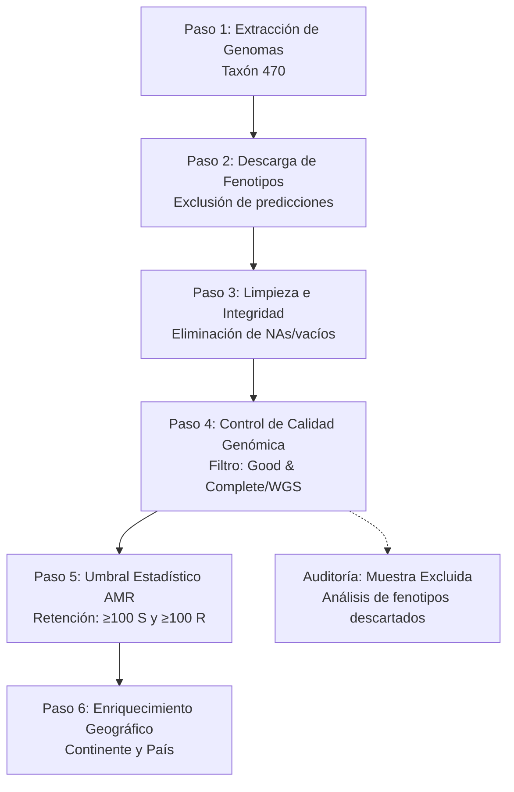

# Pipeline de Curaduría de Fenotipos AMR para *Acinetobacter baumannii*

> **Pipeline ejecutable en R para la extracción, filtrado bioinformático y auditoría estricta de fenotipos de resistencia antimicrobiana (AMR) provenientes exclusivamente de ensayos de laboratorio.**

---

##  Tabla de Contenidos

* [Racional Científico](https://www.google.com/search?q=%23-racional-cient%C3%ADfico)
* [Arquitectura del Pipeline](https://www.google.com/search?q=%23-arquitectura-del-pipeline)
* [Requisitos del Sistema](https://www.google.com/search?q=%23-requisitos-del-sistema)
* [Estructura del Repositorio](https://www.google.com/search?q=%23-estructura-del-repositorio)
* [Guía de Ejecución](https://www.google.com/search?q=%23-gu%C3%ADa-de-ejecuci%C3%B3n)
* [Descripción de Archivos de Salida](https://www.google.com/search?q=%23-descripci%C3%B3n-de-archivos-de-salida)
* [Interpretación de Indicadores Clave](https://www.google.com/search?q=%23-interpretaci%C3%B3n-de-indicadores-clave)
* [Licencia y Contacto](https://www.google.com/search?q=%23-licencia-y-contacto)

---

##  Racional Científico

Las bases de datos genómicas globales como **BV-BRC** contienen metadatos heterogéneos que combinan **ensayos experimentales reales** (CIM, disco-difusión) con **predicciones computacionales (*in silico*)**. Integrar fenotipos predecidos en estudios de asociación genotipo-fenotipo (GWAS o Aprendizaje Automático) introduce sesgos y circularidad estadística.

Este pipeline resuelve dicho problema mediante un **flujo de trabajo auditable en 6 etapas**, diseñado para retener únicamente aislados con:

1. Evidencia experimental verificada en laboratorio.
2. Calidad de ensamblado genómico validada (**Good** / **Complete-WGS**).
3. Potencia estadística adecuada ($\ge 100$ aislados susceptibles y $\ge 100$ resistentes por antibiótico).

---

## ⚙ Arquitectura del Pipeline

El flujo de procesamiento refina progresivamente la información extraída a través de la API oficial de BV-BRC:



---

## 💻 Requisitos del Sistema

* **R** ($\ge 4.2.0$) y **RStudio** (recomendado).
* **Librerías de R** (instaladas automáticamente mediante `pacman`):
* `httr`, `jsonlite`, `dplyr`, `purrr`, `tidyr`, `readr`, `pacman`


---

## 📁 Estructura del Repositorio

```text
abaumannii-amr-pipeline/
├── README.md                      <-- Documentación principal
├── R/
│   └── pipeline_bvbrc.R           <-- Código fuente modularizado
└── resultados/                    <-- Salidas en formato CSV (auto-creado)
    ├── A_baumannii_TODOS_LOS_FENOTIPOS_LABORATORIO.csv
    ├── A_baumannii_FENOTIPOS_LABORATORIO_SIN_NA.csv
    ├── lista_genomas_calidad_GOOD_WGS_COMPLETE.csv
    ├── A_baumannii_FENOTIPOS_FINAL_ALTA_CALIDAD.csv
    ├── tabla_antibioticos_filtrados_ge100.csv
    ├── distribucion_genomas_continente_pais.csv
    └── audit_223_genomas_fenotipos_SR.csv

```

---

## Guía de Ejecución

1. **Clonar o descargar el repositorio**:
```bash
git clone https://github.com/tu-usuario/abaumannii-amr-pipeline.git
cd abaumannii-amr-pipeline

```


2. **Ejecutar el pipeline en R/RStudio**:
Abre tu sesión de R orientada a la carpeta raíz del proyecto y ejecuta:
```R
source("R/pipeline_bvbrc.R")

```


---

##  Descripción de Archivos de Salida

| Nombre del Archivo | Descripción Biológica / Técnica |
| --- | --- |
| `A_baumannii_TODOS_LOS_FENOTIPOS_LABORATORIO.csv` | Registros brutos descargados descartando predicciones algorítmicas. |
| `A_baumannii_FENOTIPOS_LABORATORIO_SIN_NA.csv` | Datos filtrados excluyendo registros sin método fenotípico o sin resultado S/R. |
| `lista_genomas_calidad_GOOD_WGS_COMPLETE.csv` | Catálogo de genomas aprobados por el filtro bioinformático de calidad de ensamblado. |
| `A_baumannii_FENOTIPOS_FINAL_ALTA_CALIDAD.csv` | **Dataset Maestro Curado:** Fenotipos validados listos para modelado. |
| `tabla_antibioticos_filtrados_ge100.csv` | Lista de antibióticos que cumplen el umbral de potencia estadística ($\ge 100$ S y $\ge 100$ R). |
| `distribucion_genomas_continente_pais.csv` | Resumen geográfico de la muestra para detectar sesgos de muestreo. |
| `audit_223_genomas_fenotipos_SR.csv` | Reporte de auditoría de los fenotipos pertenecientes a genomas excluidos. |

---

##  Interpretación de Indicadores Clave

* **Genomas retenidos vs. excluidos:** Una alta tasa de retención en el **Paso 4** confirma que la muestra fenotípica proviene de ensamblados confiables.
* **Balance de Antibióticos (Paso 5):** Excluir fármacos con $<100$ aislamientos en cualquiera de las categorías previene clases desbalanceadas en algoritmos de aprendizaje supervisado.
* **Auditoría de Exclusión:** Permite justificar en la sección de *Métodos* la causa exacta por la cual ciertos aislados no ingresaron al modelo final.

---

##  Licencia y Contacto

Este proyecto está distribuido bajo la Licencia **MIT**.

* **Autor:** [J Vladimir Alvarez Poma / IIFB]
* **Contacto:** [jvalvarez1@umsa.bo]
* **Base de datos de origen:** [Recurso BV-BRC](https://www.bv-brc.org/)
* **Última actualización:** 30 de julio de 2026
* **Versión del Pipeline:** 1.0.0