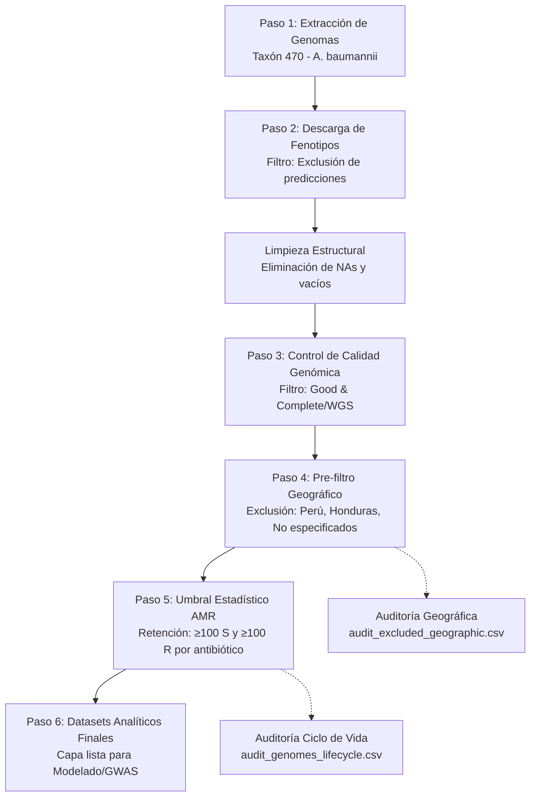

# Pipeline de Curaduría de Fenotipos AMR para *Acinetobacter baumannii*

> **Pipeline analítico ejecutable en R para la extracción, filtrado bioinformático, auditoría geográfica estricta y curaduría de fenotipos de resistencia antimicrobiana (AMR) provenientes exclusivamente de ensayos experimentales de laboratorio.**

---

## 📋 Tabla de Contenidos

- [Racional Científico](#-racional-científico)
- [Arquitectura del Pipeline](#-arquitectura-del-pipeline)
- [Requisitos del Sistema y Dependencias](#-requisitos-del-sistema-y-dependencias)
- [Estructura del Repositorio](#-estructura-del-repositorio)
- [Guía de Ejecución](#-guía-de-ejecución)
- [Descripción de Artefactos de Salida](#-descripción-de-artefactos-de-salida)
- [Trazabilidad y Auditoría de Datos](#-trazabilidad-y-auditoría-de-datos)
- [Licencia y Contacto](#-licencia-y-contacto)

---

## 🔬 Racional Científico

Las bases de datos genómicas globales como **BV-BRC** albergan metadatos heterogéneos que combinan ensayos experimentales reales (CIM, disco-difusión) con predicciones computacionales (*in silico*). La inclusión no controlada de fenotipos predichos en modelos de asociación genotipo-fenotipo (GWAS o Aprendizaje Automático) introduce sesgos y circularidad estadística.

Este pipeline resuelve dicho problema mediante un **flujo de trabajo auditable en 6 etapas**, diseñado para construir un *dataset* analítico riguroso con aislados que cumplan:

1. **Evidencia experimental verificada:** Exclusión total de predicciones algorítmicas (`Computational Prediction`).
2. **Calidad de ensamblado genómico aprobada:** Retención exclusiva de calidad `Good` y estado de ensamblado `Complete` / `WGS`.
3. **Criterio geográfico estricto:** Exclusión de países fuera de alcance del diseño de estudio (ej. Perú, Honduras) y registros con inconsistencia dual en metadatos espaciales (`No especificado` tanto en región geográfica como en país).
4. **Potencia estadística para modelado:** Retención de antibióticos con un umbral mínimo de $\ge 100$ aislados susceptibles y $\ge 100$ resistentes.

---

## ⚙ Arquitectura del Pipeline

El flujo de procesamiento refina progresivamente la información extraída a través de la API oficial de BV-BRC mediante procesamiento por lotes (*chunks*):


```mermaid
graph TD
    A[Paso 1: Extracción de Genomas<br>Taxón 470 - A. baumannii] --> B[Paso 2: Descarga de Fenotipos<br>Filtro: Exclusión de predicciones]
    B --> C[Limpieza Estructural<br>Eliminación de NAs y vacíos]
    C --> D[Paso 3: Control de Calidad Genómica<br>Filtro: Good & Complete/WGS]
    D --> E[Paso 4: Pre-filtro Geográfico<br>Exclusión: Perú, Honduras, No especificados]
    E --> F[Paso 5: Umbral Estadístico AMR<br>Retención: ≥100 S y ≥100 R por antibiótico]
    F --> G[Paso 6: Datasets Analíticos Finales<br>Capa lista para Modelado/GWAS]
    
    E -.-> H[Auditoría Geográfica<br>audit_excluded_geographic.csv]
    F -.-> I[Auditoría Ciclo de Vida<br>audit_genomes_lifecycle.csv]

```

---

## 💻 Requisitos del Sistema y Dependencias

* **Entorno R:** R ($\ge 4.2.0$) y RStudio (recomendado).
* **Gestor de Paquetes:** `pacman` (para instalación y carga automatizada).
* **Librerías Requeridas:**
* `httr`: Solicitudes HTTP y comunicación con la API de BV-BRC.
* `jsonlite`: Parsing de respuestas JSON.
* `dplyr` & `tidyr`: Transmutación y remodelado de estructuras de datos.
* `purrr`: Programación funcional y desacoplamiento de listas compuestas.
* `readr`: Persistencia eficiente de datos en disco.


---

## 📁 Estructura del Repositorio

```text
abaumannii-amr-pipeline-clear/
├── README.md                          <-- Documentación arquitectónica principal
├── LICENSE                            <-- Licencia MIT de código abierto
├── .gitignore                         <-- Protección de datos dinámicos y temporales
├── R/
│   └── run_pipeline_analytical.R      <-- Código fuente modularizado del pipeline
└── resultados_analiticos/             <-- Artefactos de salida (Directorio generado automáticamente)
    ├── abaumannii_phenotypes_raw.csv
    ├── abaumannii_phenotypes_clean.csv
    ├── abaumannii_genomes_quality_pass.csv
    ├── audit_excluded_geographic.csv
    ├── antibiotics_summary_robust.csv
    ├── audit_genomes_lifecycle.csv
    ├── abaumannii_phenotypes_analytical.csv
    ├── abaumannii_genomes_analytical.csv
    └── geographic_distribution_summary.csv

```

---

## 🚀 Guía de Ejecución

1. **Clonar el repositorio**:
```bash
git clone [https://github.com/JVladimirAlvarez-source/abaumannii-amr-pipeline-clear.git](https://github.com/JVladimirAlvarez-source/abaumannii-amr-pipeline-clear.git)
cd abaumannii-amr-pipeline-clear

```


2. **Ejecutar el Pipeline en R / RStudio**:
Abre el proyecto en RStudio y ejecuta el script principal desde la consola o terminal R:
```R
source("R/run_pipeline_analytical.R")

```


---

## 📊 Descripción de Artefactos de Salida

| Nombre del Archivo | Rol en la Arquitectura de Datos | Descripción Biológica / Técnica |
| --- | --- | --- |
| `abaumannii_phenotypes_raw.csv` | **Capa Raw** | Registros fenotípicos brutos descargados descartando predicciones algorítmicas. |
| `abaumannii_phenotypes_clean.csv` | **Capa Clean** | Registros limpios sin valores nulos en el fenotipo o en el método de laboratorio. |
| `abaumannii_genomes_quality_pass.csv` | **Capa QC** | Matriz de genomas validados con calidad `Good` y estado `Complete/WGS`. |
| `audit_excluded_geographic.csv` | **Auditoría Espacial** | Reporte independiente de registros fenotípicos descartados por criterios geográficos. |
| `antibiotics_summary_robust.csv` | **Métrica Analítica** | Tabla resumida de antibióticos que superaron el umbral ($\ge 100$ S y $\ge 100$ R). |
| `audit_genomes_lifecycle.csv` | **Gobernanza de Datos** | Matriz de trazabilidad integral que documenta el motivo exacto de aprobación o exclusión de cada genoma. |
| `abaumannii_phenotypes_analytical.csv` | **Dataset Maestro** | **Fenotipos Finales Curados:** Datos validados listos para integración en pipeline de GWAS o Aprendizaje Automático. |
| `abaumannii_genomes_analytical.csv` | **Dataset Maestro** | Metadatos genómicos correspondientes a la muestra analítica final retenida. |
| `geographic_distribution_summary.csv` | **Resumen Geográfico** | Desglose por continente y país de los genomas analíticos para control de sesgos espaciales. |

---

## 🔎 Trazabilidad y Auditoría de Datos

Para garantizar la **reproducibilidad científica de grado de publicación**, el pipeline no destruye datos descartados, sino que los canaliza a través de reportes explícitos de auditoría:

* **`audit_excluded_geographic.csv`:** Conserva el historial de los aislados apartados por no cumplir los criterios de delimitación territorial o integridad espacial.
* **`audit_genomes_lifecycle.csv`:** Actúa como el libro mayor (*ledger*) de decisiones de curaduría. Cada genoma es categorizado bajo una etiqueta inequívoca:
* `APROBADO`
* `EXCLUIDO_GEOGRAFIA`
* `EXCLUIDO_ANTIBIOTICOS`


---

## 📄 Licencia y Contacto

Este proyecto está distribuido bajo la **Licencia MIT**.

* **Autor / Investigador:** Jhonny Vladimir Alvarez Poma (IIFB)
* **Contacto:** [jvalvarez1@umsa.bo](https://www.google.com/search?q=mailto%3Ajvalvarez1%40umsa.bo)
* **Fuente de Datos:** [Resource Portal BV-BRC](https://www.bv-brc.org/)
* **Versión del Pipeline:** `2.0.0-analytical`
* **Última actualización:** Octubre de 2026
